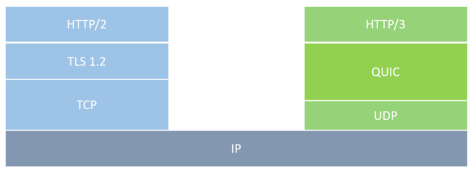
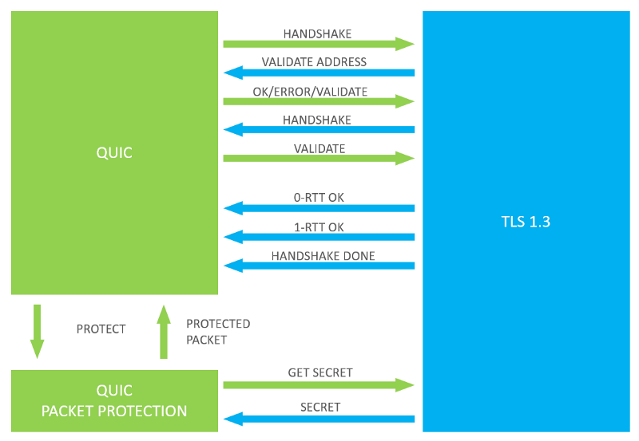

# The Internet changes: HTTP/3 will not use TCP anymore

## QUIC is the protocol underlying the next version of HTTP

the Internet Engineering Task Force (**IETF**) has revealed that the third official version of HyperText Transfer Protocol (HTTP) **will not use TCP anymore**. Instead, it will run over the QUIC protocol first developed by Google back in 2012.

## WHAT IS QUIC?

**Quick UDP Internet Connections (QUIC)** is, as its name states, a transport layer protocol based on multiplexed UDP connections. In fact, QUIC uses a combination of TCP + TLS + SPDY over UDP with several enhancements with respect to the current HTTP/2 over TCP implementation.

The **IETF has been working on a standardized version of Google’s QUIC** since 2016, and it was recently that they announced their intention to include it for the new HTTP/3 version. However, the IETF QUIC version already diverged significantly from the original QUIC design.

Position of HTTP/3 and QUIC in the protocol stack

QUIC protocol aims for **simplicity and speed while maintaining security** thanks to the TLS 1.3 encryption. They developed a more efficient protocol in terms of connection establishment and data transfer. [According to Google](https://docs.google.com/document/d/1gY9-YNDNAB1eip-RTPbqphgySwSNSDHLq9D5Bty4FSU/edit), **QUIC handshakes frequently require zero roundtrips** before sending payload, as compared to 1–3 roundtrips for TCP+TLS. Actually, the first connection ever requires one roundtrip and the followings will work with zero.

Furthermore, it **deals better with packet loss than the current TCP**. Every retransmitted packet consumes a new sequence number, hence eliminating ambiguities and preventing losses from causing RTO. As [Jana Iyengar from IETF](https://docs.google.com/presentation/d/15e1bLKYeN56GL1oTJSF9OZiUsI-rcxisLo9dEyDkWQs/edit#slide=id.g5b4208ab1_0_272) states, QUIC is not only a redefinition of the Internet transport layer but a **reinvention to do the transport right**.

At the moment, only 1.2 % of the top websites support [QUIC](https://w3techs.com/technologies/details/ce-quic/all/all), but they are generally high-traffic sites: almost every Google service supports their own QUIC protocol.

## IS QUIC SECURE?
QUIC first development included its own encryption. However, it was just a temporary implementation destined to be replaced by **TLS 1.3 as described by the IETF**.

Actually, the connection establishment strategy of QUIC is based on the combination of crypto and transport handshake.

> QUIC relies on a combined cryptographic and transport handshake to
   minimize connection establishment latency.

Integration of QUIC and TLS, adapted from the IETF’s draft of “Using Transport Layer Security (TLS) to Secure QUIC”.

With QUIC, Everything will be encrypted by default. Nevertheless, there are indeed **security risks** with QUIC as with any other technology.

The work of [Robert Lychev and Samuel Jero](https://www.cc.gatech.edu/~aboldyre/papers/quic.pdf) in 2015 reported several weaknesses of the protocol. QUIC **performance can be degraded by attacks** like the Server Config Replay Attack. However, **the confidentiality and the authenticity of the data seem to be properly secured** according to their security model and tests.

[Understanding Event-Driven Architectures (EDA): the paradigm of the future](https://medium.com/drill/understanding-event-driven-architectures-eda-the-paradigm-of-the-future-7ae632f056bb)

[BITCOIN case study: applying basic Digital Signal Processing into financial data](https://medium.com/drill/btc-case-study-applying-basic-digital-signal-processing-into-financial-data-ec34cd47c77b)

If you want to learn more about QUIC and how it will be integrated into the next version of HTTP, I strongly recommend you to check the official documentation from Google and the drafts published by IETF. You can find them in the bibliography of this article!

Innovation is always spinning forward. Just like a Drill.

## BIBLIOGRAPHY

[1] ”QUIC, a multiplexed stream transport over UDP — The Chromium Projects”, Chromium.org. [Online]. Available: https://www.chromium.org/quic. [Accessed: 18- Nov- 2018]

[2] M. Thomson, “draft-ietf-quic-transport-16 — QUIC: A UDP-Based Multiplexed and Secure Transport”, Tools.ietf.org, 2018. [Online]. Available: https://tools.ietf.org/html/draft-ietf-quic-transport-16. [Accessed: 18- Nov- 2018]

[3] S. Turner, “draft-ietf-quic-tls-03 — Using Transport Layer Security (TLS) to Secure QUIC”, Tools.ietf.org, 2018. [Online]. Available: https://tools.ietf.org/html/draft-ietf-quic-tls-03#section-3. [Accessed: 18- Nov- 2018]

[4] E. Rescorla, “The Transport Layer Security (TLS) Protocol Version 1.3”, Tools.ietf.org, 2018. [Online]. Available: https://tools.ietf.org/id/draft-ietf-tls-tls13-23.html. [Accessed: 18- Nov- 2018]

[5] R. Lychev, S. Jero, A. Boldyreva and C. Nita-Rotaru, “How Secure and Quick is QUIC? Provable Security and Performance Analyses”, 2015. [Online]. Available: https://www.cc.gatech.edu/~aboldyre/papers/quic.pdf. [Accessed: 18- Nov- 2018]

Nov 18, 2018 （2018-11-18）

author: Telmo Subira Rodriguez

link: <https://medium.com/drill/the-internet-changes-http-3-will-not-use-tcp-anymore-427e82eeadc0>