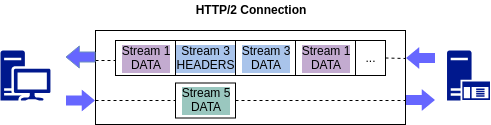

# What is HTTP/2?

Before diving straight into the topic, let’s first look at some of the HTTP/2 terminologies used frequently.

* Stream: An established bidirectional connection which may carry one or more messages
* Message: A complete sequence of frames that represents a request or response message
* Frame: The smallest unit of communication in HTTP/2. Each frame contains a frame header which could identify the stream to which the frame belongs.
* h2: Short term for HTTP/2

**Note:** It was originally named as HTTP/2.0 but later “.0” part was dropped because it has caused some confusions with HTTP/1.x. So we no longer use HTTP/2.0, it’s HTTP/2 or h2 for short 😊

## Overview of HTTP/2

HTTP/2 is a major revision of the HTTP network protocol which is still being widely used over the World Wide Web. It was developed to overcome some of the drawbacks found in HTTP/1.0 and HTTP/1.1 versions. Overhead of repetitive headers and **Head-of-line blocking** (HOL blocking — when one request is blocking others from completing) are two such major problems addressed.

HTTP/2 enables more efficient use of network resources, header fields compression, multiple concurrent exchanges on the same connection reducing the latency to a great extent.

HTTP/2 also introduces **Server Push** that allows a server to send desired data to a client that the server anticipates the client will need in the future. Thus, HTTP/2 provides enhanced security, speed, and usability.

HTTP/2 uses the same URI scheme and shares the same default HTTP ports as of HTTP/1.1.

All communication is performed over a single TCP connection that can carry any number of **bidirectional** streams. Each stream has a unique identifier and optional priority information that is used to carry bidirectional messages. The frame is the unit of communication and there are several types of frames such as HEADER, DATA, and SETTINGS. For request and response communication, HEADER and DATA frames are primarily being used.

## Key benefits of HTTP/2

### Multiplexing

Unlike in HTTP/1.1 where each transfer has to wait till other transfers complete, in HTTP/2, multiple requests are allowed at the same time on the same connection.

In HTTP/1.x, only one response can be delivered at a time per connection, and if the client wants to make multiple parallel requests, then multiple TCP connections must be used. This also results in head-of-line-blocking and inefficient use of underlying TCP connection.

HTTP/2 overcomes these limitations by using the new binary framing layer ( where all HTTP/2 communication is split into smaller messages and frames and each of them is encoded in binary format so that both the client and server must use the new binary encoding mechanism in order to understand each other. Thus, an HTTP/1.x client will not understand an HTTP/2 only server and vice versa. ) by allowing the client and server to break down a message into independent frames, interleave them and reassemble them on the other end.

For example,

The above diagram illustrates multiple streams within the same connection. The client is transmitting a DATA frame over stream 5 to the server, while the server is transmitting an interleaved sequence of frames to the client over stream 1 and 3.

This also enables several performance benefits such as remove unnecessary HTTP/1/x workarounds in concatenated files, image sprites and domain sharding ( for further read refer: [Optimizing for HTTP/1.x](https://hpbn.co/optimizing-application-delivery/#optimizing-for-http1x) ), reduce the page load time by removing unnecessary latency and improving the utilization of available network capacity.

### Header compression

As web pages have grown to require dozens to hundreds of requests, the redundant header fields in these requests unnecessarily consume bandwidth, measurably increasing latency. So, HTTP/2 forces all HTTP headers to be sent in a compressed format, reducing the amount of information that needs to be exchanged between the client’s browser and the server whereas HTTP/1.1 does not provide any form of header compression.

The compression works on per connection basis. That is, all the streams in one connection share the same compressor. If the compressor realizes that it has sent a header before, it will not resend that header, instead just says ‘the same header as before’. So, some headers that never change like Host, Accept or Cookies will not get resent, and that will save a lot of bytes! 😃

### Server Push

Through the server push, additional resources can be sent to the client for future use, before the client even requests them.

Here, the server understands which resources the browser needs before the browser requests for them. Then the server will push these resources to the browser before it requests for them. This makes the entire process of retrieving all resources much faster.

As an example when a browser requests a web page, a server responds with an HTML page and browser has to parse it and request again all embedded assets such as images, CSS and JavaScript files. In HTTP/2, using the server push concept a server can be configured to send all required assets according to a client’s request before the client requests them explicitly.

### Stream Priority

While multiplexing enables sending multiple requests concurrently, stream priority enables you to define which response should come first. I.e. it helps you to define the importance of one stream relative to the other streams on the same connection via weight and dependency associated with each stream. As a result, we can optimize the resource usage via controlling the allocation of CPU, memory, bandwidth and many other resources while ensuring the delivery of high priority responses to the client.

### Flow control

This is introduced to prevent any destructive interference on streams with each other that are in the same connection that might have caused as a result of multiplexing which introduces contention over use of the TCP connection causing blocked streams. Flow control is used for both individual streams and for the connection as a whole.

### Error handling

HTTP/2 handles two classes of errors.

1. Connection error — any error that prevents further processing of the frame layer or corrupts any connection state.
2. Stream error — an error related to a specific stream that does not affect the processing of other streams.

I will be talking on How to Write an HTTP/2 Service and a Client in my next story 😊

Mar 11,2019 （2019-03-11）

author: Varuni Punchihewa

link: <https://blog.usejournal.com/what-is-http-2-380d277d208c>